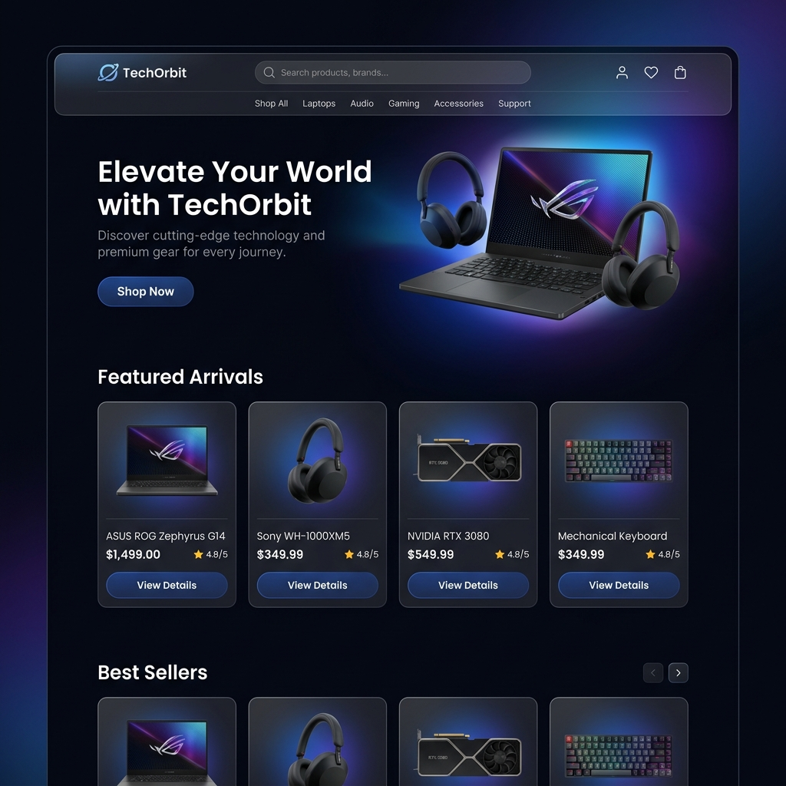

# 🚀 TechOrbit - Modern E-Commerce Platform



**TechOrbit** is a high-performance, full-stack e-commerce application designed for the modern web. Built with the **MERN stack** and powered by **Redux** for state management, it offers a seamless, premium shopping experience for tech enthusiasts.

---

## ✨ Key Features

### 🛒 Shopping Experience
- **Dynamic Product Catalog**: Browse a wide range of tech products with high-quality images.
- **Advanced Filtering**: Filter products by category, price range, and rating.
- **Persistent Cart**: Secure shopping cart that persists across user sessions.
- **Seamless Checkout**: Integrated with **Stripe** for secure and fast payment processing.

### 🔐 User & Security
- **JWT Authentication**: Secure login/signup with JSON Web Tokens and Bcrypt hashing.
- **User Dashboard**: Track order history and manage personal profile details.
- **Role-Based Access**: Specialized views and permissions for Users and Admins.

### 🛠 Administrative Tools
- **Admin Dashboard**: Comprehensive management of products, users, and orders.
- **Data Analytics**: Visual insights into sales and customer engagement.
- **Automated Seeding**: Built-in scripts to populate the database with mock data for development.

---

## 🛠 Tech Stack

| Layer | Technology |
| :--- | :--- |
| **Frontend** | React, Redux (Toolkit), Styled Components, Axios |
| **Backend** | Node.js, Express.js |
| **Database** | MongoDB (Mongoose ODM) |
| **Payments** | Stripe API |
| **Validation** | Joi |
| **Logging** | Winston |
| **Dev Tools** | Faker.js (Seeding), Nodemon, Cross-env |

---

## 📁 Project Structure

```text
Redux-TechOrbit-/
├── client/           # React frontend application
│   ├── src/          # Source code (Components, Pages, Redux Slices)
│   └── public/       # Static assets
├── server/           # Node.js/Express backend
│   ├── models/       # Mongoose Schemas (User, Product, Order)
│   ├── routes/       # API Endpoints (Auth, Cart, Stripe)
│   ├── services/     # Business logic layer
│   └── scripts/      # Database seeding scripts
└── assets/           # Project documentation media
```

---

## 🚀 Getting Started

### 📋 Prerequisites
- **Node.js** (v16.x or higher)
- **MongoDB** (Local instance or Atlas Cluster)
- **Stripe Account** (for API keys)

### ⚙️ Installation

1. **Clone the repo:**
   ```bash
   git clone https://github.com/Anurag-elitx/Redux-TechOrbit-.git
   cd Redux-TechOrbit-
   ```

2. **Install all dependencies:**
   ```bash
   npm run install:all
   ```

### 🔑 Environment Variables
Create a `.env` file in the `server` directory:
```env
PORT=5000
MONGODB_URL=your_mongodb_connection_string
JWT_SECRET=your_super_secret_key
STRIPE_KEY=your_stripe_secret_key
```

### ▶️ Running the App
Start both servers concurrently:
```bash
npm start
```
- **Frontend**: [http://localhost:3000](http://localhost:3000)
- **Backend**: [http://localhost:5000](http://localhost:5000)

---

## 🧪 Seeding Data
To quickly populate your database with dummy data:
```bash
cd server
npm run seed:dev
```

---

## 📄 License
Distributed under the **ISC License**. See `LICENSE` for more information.

---
*Built with ❤️ by [Anurag](https://github.com/Anurag-elitx)*
